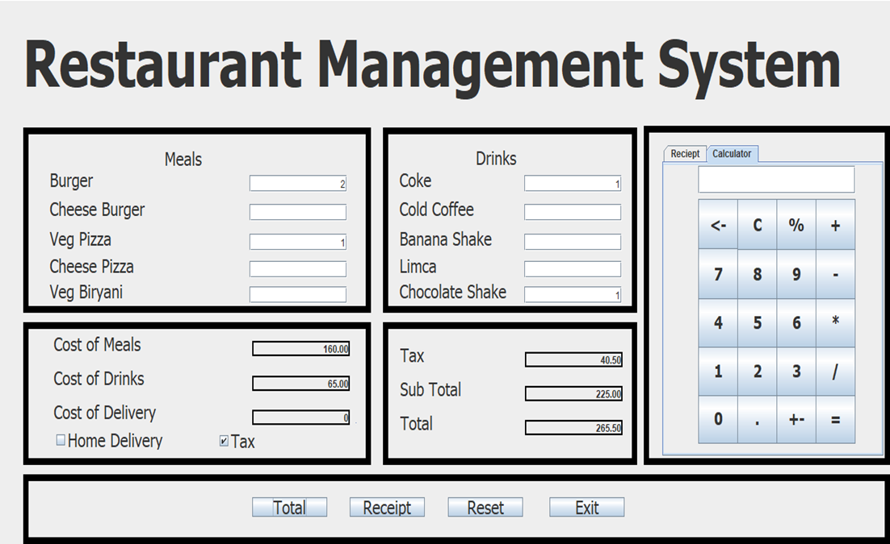
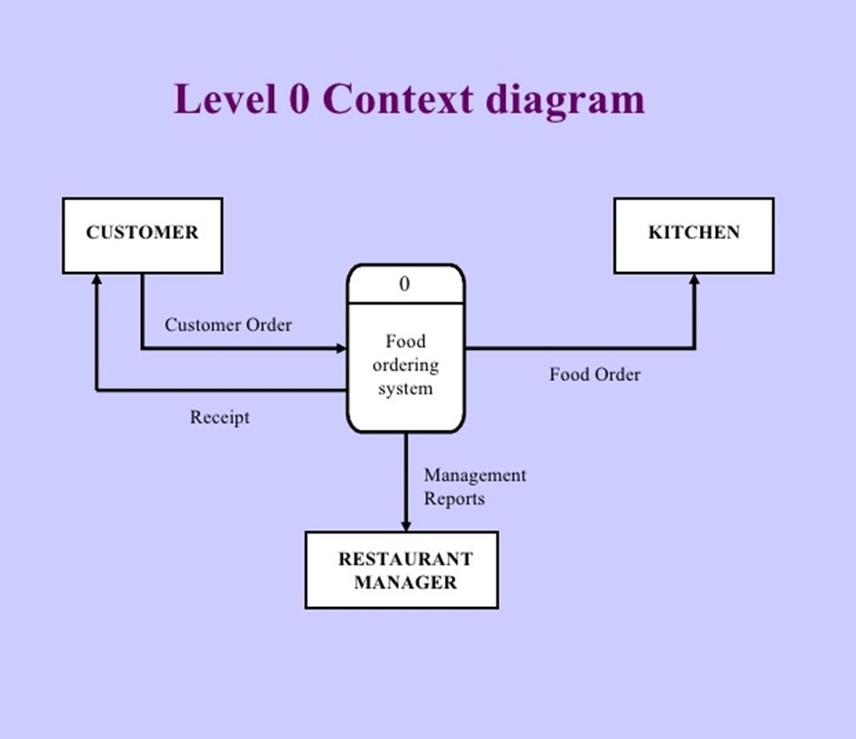
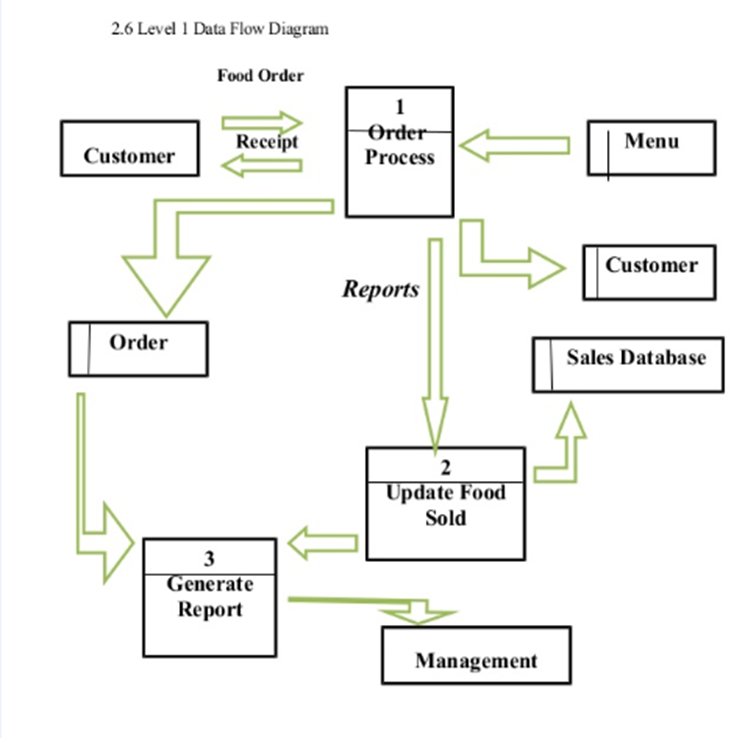
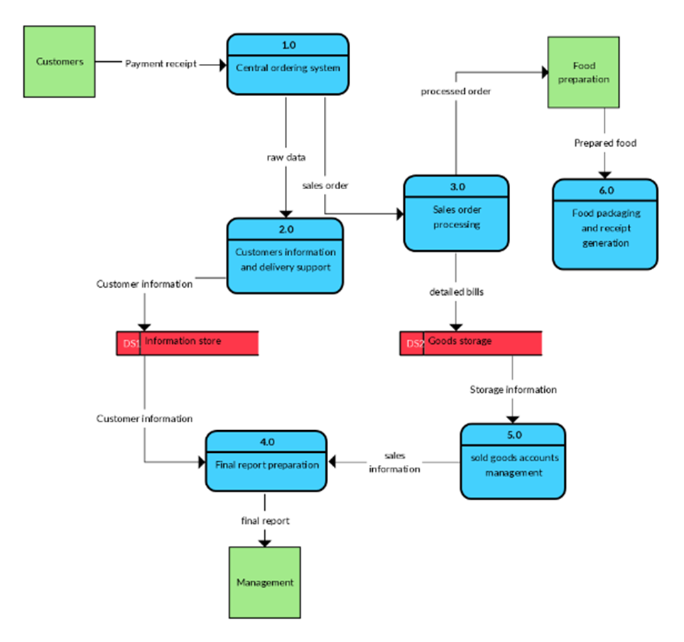

# Project2
RESTAURANT MANAGEMENT SYSTEM

ABSTRACT

The project “Restaurant Management System” is implemented to reduce the manual work and enhances the accuracy of work in a restaurant. This system manages and maintains the record of customers and room in the hotel. The room has different categories such as A/c., non-A/c., dormitory etc., so the charges and records will be maintained accordingly. This software has been made in a user friendly interface. So that normal person can add and delete the entries of customers and handle all the transactions easily. This project is also designed with full consideration to help the users in an easy manner without any unnecessary wastage of time. This system can be implemented in big restaurant where customers can order their food from their room using system. The menu card consists of various food varieties available in the restaurant. Through the ordering form, the customer can simply click and order the food. The messaging system tells the supplier to supply the particular food. The billing system prepares the bill according to the delivered food. This system entirely reduces the unnecessary time waste inside the hotel as well as it reduces unnecessary noise. This Online Tourism Management has more useful information about the particular place. It is very useful to gather the details without spending more time. So it is a good timekeeper to all. There is no requirement of tourist guide to guide us to the particular place. Thus the project acts as a good tourist guide for the visitors. EXISTING SYSTEM: Many restaurants have a lot difficult to manage the business such as customer ordering and reservation table. By using manual customer ordering is difficult to waiter keep the correct customer information and maybe loss the customer information. In many popular restaurants, waiters/waitresses tend to miss out on tables or customers’ calls during busy hours potentially decreasing ones clientele. While this is an ongoing issue, there is still no product that drastically improves the communication between the servers and the customers in the current market.

INTRODUCTION
RMS Restaurant Management Systems are the crucial technology components that enable a single outlet or enterprise to better serve its customers and aid employees with food and beverage transactions and controls.
2. RMS: Components
Four main offerings:
	POS
	Inventory and Menu Management 	Systems
	Reservations and Table Management
	Back office applications
RMS: POS	
	Definition:
	A point of sale system is either a stand-alone machine or a network of input and output devices used by restaurant employees to accomplish their daily activities including food and beverage orders, transmission of tasks to the kitchen and other remote areas, guest-check settlement, credit card transaction processing, and charge posting folios
	Other Functionalities:
	Decreased service time
- Kitchen, bar, offices, host stand
	Order Accuracy
- List of fields
	Security of Cash Transactions and Internal Auditing Functions
- User ID
- Record tracking
Inventory and Menu Management
•	Inventory levels and consumption
•	Purchasing
Theft
Inventory Levels and Consumption
•	Par Stock
•	Consumption volume, rate, and sales price
•	Reconcile Physical Inventory with POS Inventory
Purchasing
•	Dates of purchases and delivery, quantity, and purchase price
•	Alerts to rotate/use stock
•	Some items hard to track (fish, vegetables)
Food cost controls are critically important
Benefits of Inventory and Menu Management
•	Some view as disruptive
- time to enter User ID’s
•	Nutritional monitoring
•	Predictive modeling and variable analysis
Reservation and Table Management
•	May be part of or separate from POS
•	Reservations simplistic in nature
- name, number in party, phone, date, time, etc.
•	Table management designed to allocate reservation/wait/walk-in list with tables, locations, services
•	A map of front-of-the-house seating
•	Alerts on open, long duration, dirty tables
•	Reservation assignment tables
•	Wait staff assignment
Interfaces:
•	Interface with hotel software
•	Interface with accounting software
. Other RMS Systems:
DRMS: Delivery Management System
•	Emphasizes delivery of orders
- “delivered” to counter or drive-through
•	Storefront Operations
•	System Functions
Back Office

1.1	Features of Project
	Simple menu setup. Menu is easy to configure.
	User friendly order management.
	Inventory control.
	Comprehensive reporting and customer data.
	Marketing and loyalty programs.
	Heavenly Technical Support.
	It provides offline mode of management.
	Easy Integration.

1.2  Purpose of Project

This project is also designed with full consideration to help the users in an easy manner without any unnecessary wastage of time. This system can be implemented in big restaurant where customers can order their food from their room using system. The menu card consists of various food varieties available in the restaurant. Through the ordering form, the customer can simply click and order the food. The messaging system tells the supplier to supply the particular food. The billing system prepares the bill according to the delivered food. This system entirely reduces the unnecessary time waste inside the hotel as well as it reduces unnecessary noise. It is very useful to gather the details without spending more time. So it is a good timekeeper to all. There is no requirement of tourist guide to guide us to the particular place. Thus the project acts as a good tourist guide for the visitors. EXISTING SYSTEM: Many restaurants have a lot difficult to manage the business such as customer ordering and reservation table. By using manual customer ordering is difficult to waiter keep the correct customer information and maybe loss the customer information. In many popular restaurants, waiters/waitresses tend to miss out on tables or customers’ calls during busy hours potentially decreasing ones clientele. While this is an ongoing issue, there is still no product that drastically improves the communication between the servers and the customers in the current mark.

GENERAL DESCRIPTION

2.1 About  JAVA                                                                                                                                                  
Java is a general purpose computer programming language that is concurrent, class-based, object oriented, and specifically designed to have a few implementation dependencies as possible. 
Java is intended to let application developers “write once, run anywhere” meaning that compiled java code can run on any platforms that support Java without the need for any recompilation. Java applications are typically compiled to  bytecode that can run on any Java virtual machine(JVM) regardless of the computer architecture. Java is one of the most popular programming language in use, particularly for client-server web applications. Java was originally developed by James Gosling at SunMicrosystems and released in 1995 as a core component platform.

One design goal of Java is portability,which means that programs written for the Java platform must run similarly on any combination of hardware and operating system with adequate runtime support. Java bytecode instructions are analogous to machine code, but they are intended to be executed by a virtual machine written specifically for the host hardware. End users commonly use a Java Runtime Environment installed on their own machine for standalone Java applications, or in web browser for Java applets.

Standard libraries provide a generic way to access host-specific features such as graphics. Threading, and networking.

SWDLC PHASES
3.1 PURPOSE:
 This project is designed with full consideration to help the users in an easy manner without any unnecessary wastage of time. This system can be implemented in big restaurant where customers can order their food from their room using system. The menu card consists of various food varieties available in the restaurant. Through the ordering form, the customer can simply click and order the food.
3.2 HARDWARE REQUIREMENTS:
	Window platform like:2000 professional, XP, 7.
	HDD-100GB or above.
	RAM- 1GB or above.
	Processor Speed-1.2 GHz or above.
	Intel Pentium and Celeron class processor and core processor.

3.3 SOFTWARE REQUIREMENTS
	Java eclipse.
	Works efficiently in Google Chrome, Mozilla Firefox and internet explorer.

PROJECT  METHODOLOGY

RESEARCH METHODOLOGY

 Research methodology has many research dimensions and methods. The scope of research methodology is wider than research method. This is mainly adopted by the researcher in undertaking this research. Methodology is the underlying principles and rules that govern a system method, on the other hand it is a systematic procedure for a set of activities. Thus, from these definitions a methodology encompasses the methods used within a study. A waterfall model under the software development life cycle (SDLC) is the methodology used to produce the online food ordering system and the customer self ordering system. It is used by system developers to produce or alter information systems or software. It divides the development process into several stages or processes. After the completion of one stage, it will logically move to another stage. Sometimes moving back to the previous stage is necessary due to failure that occurs in current stage. System design methods are a discipline within the software development industry which seeks to provide a framework for activity and the capture, storage, transformation and dissemination of information so as to enable the economic development of computer systems that are fit for purpose.

METHODS OF DATA COLLECTION

 Although there are various methods of data collection, the researcher chose the two main sources of data collection in carrying out their study. They are: 1. Primary source 13 2. Secondary source The primary source refers to the sources of collecting original data in which the researcher made use of empirical approach such as personal interview. The secondary sources of data for this kind of project cannot be over emphasized. The secondary data were obtained by the researcher from magazines, journals, newspapers and library source.

SYSTEM DESIGN

 

4.1. MODULE DESIGN
Software design sits at the technical kernel of the software engineering process and is applied regardless of the development paradigm and area of application. Design is the first step in the development phase for any engineered product or system. The designer’s goal is to produce a model or representation of an entity that will later be built. Beginning, once system requirement have been specified and analyzed, system design is the first of the three technical activities -design, code and test that is required to build and verify software. 

The importance can be stated with a single word “Quality”. Design is the place where quality is fostered in software development. Design provides us with representations of software that can assess for quality. Design is the only way that we can accurately translate a customer’s view into a finished software product or system. Software design serves as a foundation for all the software engineering steps that follow. Without a strong design we risk building an unstable system – one that will be difficult to test, one whose quality cannot be assessed until the last stage.

During design, progressive refinement of data structure, program structure, and procedural details are developed reviewed and documented. System design can be viewed from either technical or project management perspective. From the technical point of view, design is comprised of four activities – architectural design, data structure design, interface design and procedural design.

4.2. DATA FLOW DIAGRAMS
A data flow diagram is graphical tool used to describe and analyze movement of data through a system. These are the central tool and the basis from which the other components are developed.  The transformation of data from input to output, through processed, may be described logically and independently of physical components associated with the system.  These are known as the logical data flow diagrams. The physical data flow diagrams show the actual implements and movement of data between people, departments and workstations.  A full description of a system actually consists of a set of data flow diagrams.  Using two familiar notations Yourdon, Gane and Sarson notation develops the data flow diagrams. Each component in a DFD is labeled with a descriptive name.  Process is further identified with a number that will be used for identification purpose.  The development of DFD’S is done in several levels.  Each process in lower level diagrams can be broken down into a more detailed DFD in the next level.
 The lop-level diagram is often called context diagram. It consists of a single process bit, which plays vital role in studying the current system.  The process in the context level diagram is exploded into other process at the first level DFD.
A DFD is also known as a “bubble Chart” has the purpose of clarifying system requirements and identifying major transformations that will become programs in system design.  So it is the starting point of the design to the lowest level of detail.  A DFD consists of a series of bubbles joined by data flows in the system.

DFD SYMBOLS:
In the DFD, there are four symbols
1.	A square defines a source(originator) or destination of system data
2.	An arrow identifies data flow.  It is the pipeline through which the information flows
3.	A circle or a bubble represents a process that transforms incoming data flow into outgoing data flows.
4.	An open rectangle is a data store, data at rest or a temporary repository of data

	Process that transforms data flow
				

				            Source or Destination of data	
									
Data flow

Data Store

CONSTRUCTING A DFD:
Several rules of thumb are used in drawing DFD’S:
1.	Process should be named and numbered for an easy reference. Each name should be representative of the process.
2.	The direction of flow is from top to bottom and from left to right. Data traditionally flow from source to the destination although they may flow back to the source.  One way to indicate this is to draw long flow line back to a source.  An alternative way is to repeat the source symbol as a destination. Since it is used more than once in the DFD it is marked with a short diagonal.
3.	When a process is exploded into lower level details, they are numbered.
4.	The names of data stores and destinations are written in capital letters. Process and dataflow names have the first letter of each work capitalized.
A DFD typically shows the minimum contents of data store.  Each data store should contain all the data elements that flow in and out.Questionnaires should contain all the data elements that flow in and out.  Missing interfaces redundancies and like is then accounted for often through interviews.

SALIENT FEATURES OF DFD’S

1.	The DFD shows flow of data, not of control loops and decision are controlled considerations do not appear on a DFD.
2.	The DFD does not indicate the time factor involved in any process whether the dataflow take place daily, weekly, monthly or yearly.
3.	The sequence of events is not brought out on the DFD.
TYPES OF DATA FLOW DIAGRAMS
1.	Current Physical
2.	Current Logical
3.	New Logical
4.	New Physical

DATA FLOW
A Data Flow has only one direction of flow between symbols.  It may flow in both directions between a process and a data store to show a read before an update.  The later is usually indicated however by two separate arrows since these happen at different type.
1)	A join in DFD means that exactly the same data comes from any of two or more different processes data store or sink to a common location.
2)	A data flow cannot go directly back to the same process it leads.  There must be atleast one other process that handles the data flow produce some other data flow returns the original data into the beginning process.
3)	A Data flow to a data store means update (delete or change).
4)	A data Flow from a data store means retrieve or use.

Level 0 Diagram for Restaurant Management System

 

 

Level 1 Diagram for Restaurant Management System

 

Level 2 Diagram for Restaurant Management System

 

 
CONCLUSION

An experiment was conducted in a restaurant setup to check statistically if the menu management system reduces the order processing time. The experiment is successful and the mean of order processing time reduced from 7.7 minutes to 3.36 minutes thus proving the alternate hypothesis. The second objective is to maintain or increase the customer satisfaction with the use of mobile application. The customer satisfaction has been proved with the average point of more than 4 in all evaluation form questions. This shows that customer satisfaction has increased with the introduction of mobile application. Hence both the objectives are met and, the experiment is successful. The menu management system aims at reducing the manual order processing time by introducing an automated solution. With the new system, the customers can place the order with their smartphones. The waiters can then get the orders and its location on their device. Order delivery task is still manual, but the waiters save the time going to the respective tables to collect orders.

FUTURE SCOPE

After the application was deployed and the experiment was conducted in the restaurant, the project team spent more time at the restaurant to understand the customer reaction of the new system. The observation also helped to analyze the actual operations of the restaurant, and the associated improvements in the application can make it more helpful for the order processing activity. In the next two paragraphs, the improvements suggested by the customers and the restaurants are described. The customers, through the evaluation forms and some directed conversations, suggested the following improvements to the application that the project team decided to implement in the future versions of the application:

• Many users felt that the scroll bar in the menu with a long list of menu items should be avoided, as it is difficult to scroll using the smartphone. Therefore, the future UI design of Customer View will be without the scroll bar. 

• Others felt that shortcuts like ‘repeat last order’, similar to the manual scenario will increase the power of the application. The project team decided to observe the restaurant operations more closely on the current scenarios in the order taking process for identifying new features to the application. Order repetition shortcut is a good idea for the next release. 

• UI needs to be improved even more and the ‘add to tray’ option should be reconsidered. Few users were not able to understand this feature and could not understand why the selected item is not reflected in the order screen.
 
• Reduce the number of clicks for placing the order for default settings on most frequently used items and drinks. While observing the restaurant operations, and talking to the waiters and the restaurant management, the following new features have been identified: Master Project Design, Implementation, and Evaluation of a Menu Management System for Restaurants .

• A separate billing system also needs to be handled that can generate the customer bills at the time of payment. Therefore, integration with the billing functionality is a key for the order management system to be operational beyond the experiment. 

• More than one waiter cannot view an order which is not good when more than one waiter is using the system. Hence multiple waiter synchronization is an important feature that should be added in the future versions of the application.

 • During the development of the application, a lot of effort put to the usability of Customer View as they cannot be trained for the application use. But the project team realized that in order for the application to achieve the objectives in a better fashion, the usability of Waiter View should also be considered important. Hence, a better UI for Waiter View will be a part of the next version of the application.
BIBLIOGRAPHY
[1]. Software Engineering by Roggers S. Pressmen
[2]. System Analysis & Design by E.Awad
[3]. www.w3schools.com 
[4]. www.cssgenerator.com
[5] Java: The Complete Reference by Herbert Schildt.

